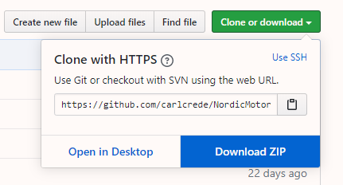
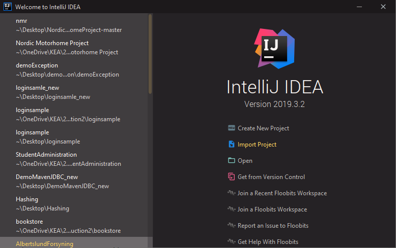
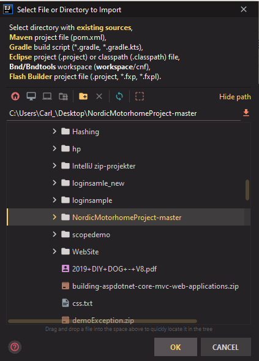
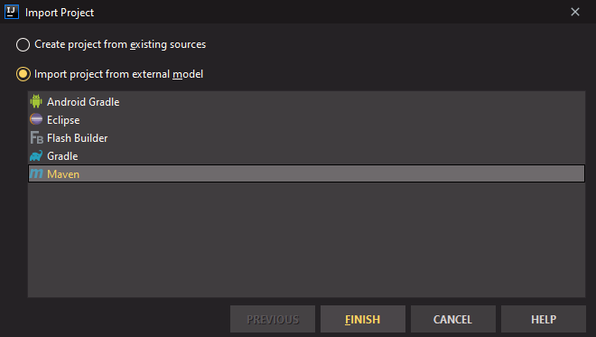

# Nordic Motorhome Project

Eksamensprojekt for Datamatiker førsteårseksamen på KEA 2020.

Projektdeltagere:

Christian Hasselbalch, Jannick Espersen, Philip Specht &amp; Peter Hartmann

**Projektbeskrivelse**

Dette projekt er en eksamensopgave, hvor vi havde til opgave at levere første version af et administrativt system til en fiktiv virksomhed &quot;Nordic Motorhome Rentals&quot;. Det er en virksomhed hvis forretning består i at udleje autocampere.

**Produktkrav**

***Teknisk***
- Program skrevet i Java.
- Logisk lagdelt arkitektur, der kan køre på en Java server (Tomcat)
- MySQL database.
- Webinterface med Spring Boot
- Brug af Java klasser, Spring controllere, HTML, CSS og Thymeleaf

***Domæne***
- Programmet skal kunne håndtere informationer om kunder, autocampere og udlejninger.
- I første version af systemet er brugerne virksomhedens medarbejdere. I en fremtidig version skal kunder kunne lave reservationer.

**Systembeskrivelse**

I denne første udgave af systemet &#39;Nordic Motorhome Project&#39; (nmp) er der implementeret følgende.

1. Man skal logge ind for at benytte systemet. Hver medarbejder har et unikt brugernavn og en adgangskode. Hver type medarbejder har kun adgang til de funktioner de har behov for. F.eks. ejer har adgang til samtlige funktioner, imens salgsassistent kun kan se og oprette nye ordrer.
2. Håndtering af motorhomes (autocampere). Man kan se en liste over alle motorhomes, og her kan man se detaljer, redigere og slette. Man kan også tilføje et nyt motorhome til listen.
3. Håndtering af extras (ekstraudstyr). Samme funktionalitet som ved motorhomes.
4. Håndtering af udlejninger/ordrer. Man kan se en liste over alle ordrer. Desuden kan man oprette en ny ordre.

Al data gemmes på en MySQL database som er hostet via GearHost.

## Guide til opsætning med GitHub og GearHost-database

**Softwarekrav:**

Et integreret udviklingsmiljø (IDE) som understøtter Maven projekter. F.eks. IntelliJ IDEA.

**Internet:**

Der kræves en internetforbindelse for at kunne forbinde til databasen.

**Importering af projekt fra GitHub**

1. Før musen over &quot;Clone or download&quot; og vælg &quot;Download ZIP&quot;. Gem filen et sted på din PC, og pak den herefter ud i en mappe.
2. Åbn din IDE og importer projektet som Maven projekt. Herunder ses hvordan det gøres i IntelliJ IDEA.

3. Vælg &quot;Import project&quot;

4. Find og marker mappen med  projektet og vælg &quot;OK&quot;.

5. Markér &quot;Import project from external model&quot;, vælg så &quot;Maven&quot; i listen og vælg til sidst &quot;FINISH&quot;.

6. Nu kan programmet køres ved at trykke på &quot;Run&quot; knappen, vælge &quot;Run&quot; under Run-fanen eller ved at trykke SHIFT+F10.

7. Åben nu din browser og gå til &quot;localhost:8080&quot;.

8. Log ind med brugernavn og password fra skemaet herunder.

**Login**

I systemet er det implementeret et login systemet inden man får adgang til resten systemets funktionaliteter. Når man logger ind som &quot;ejer&quot; har man fuld adgang til alle funktionaliteter i systemet. Der kan logges ind som forskellige typer af medarbejdere. Se skemaet nedenfor.

Bemærk forskel på store og små bogstaver i password.

| **Brugernavn** | **Password** | **Stilling** |
| --- | --- | --- |
| ke2020 | Keaeksamen2020! | Ejer |
| jd1234 | MitKodeord123! | Ejer |
| ch1995 | kunSalg\_TilMig? | Salgsassistent |

De resterende typer af medarbejdere har ikke noget login endnu, da der ikke er implementeret funktionalitet til dem.

## Guide til opsætning med lokal database

Såfremt man ønsker at bruge en lokal database, eller hvis GearHost databasen ikke virker skal denne guide følges.

Step 1-5 følges som nævnt ovenfor.

For at få en lokal database på din maskine skal det vedhæftede SQL-script køres i MySQL Workbench eller lignende. Herefter skal du i IntelliJ-projektet ændre user, password og url i &quot;application.properties&quot; filen, eller erstatte den med din egen.

Herefter kan programmet startes som i step 6.
